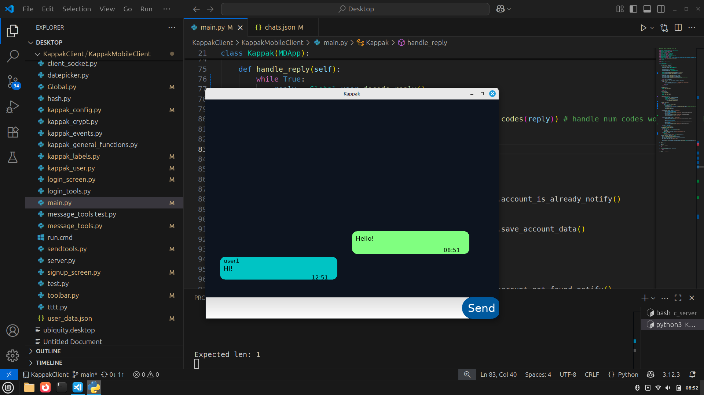
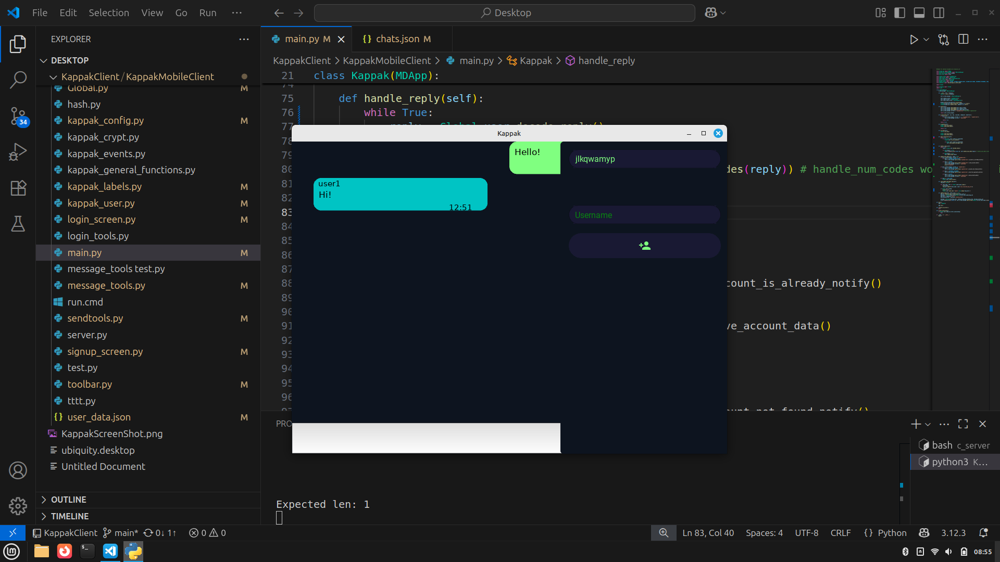
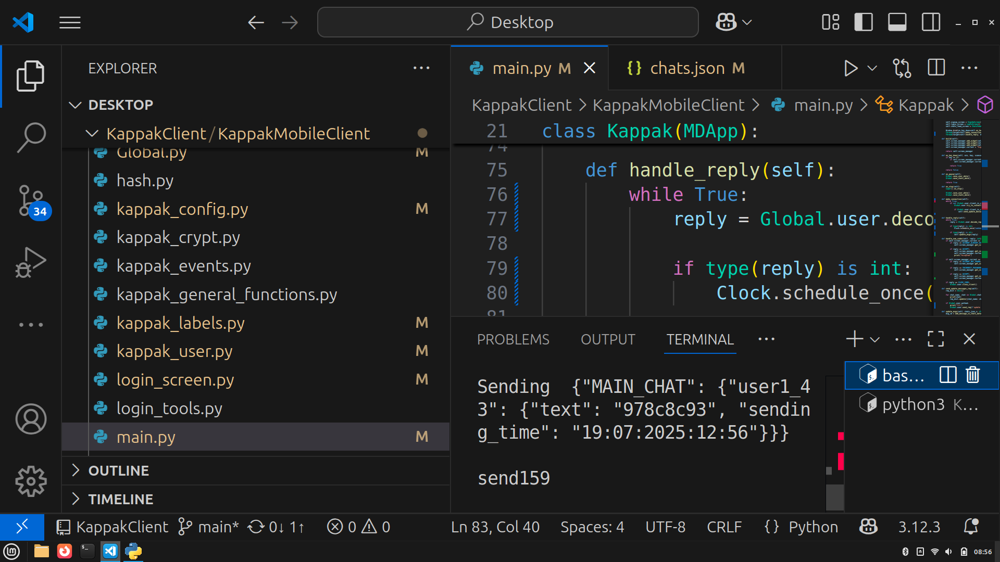
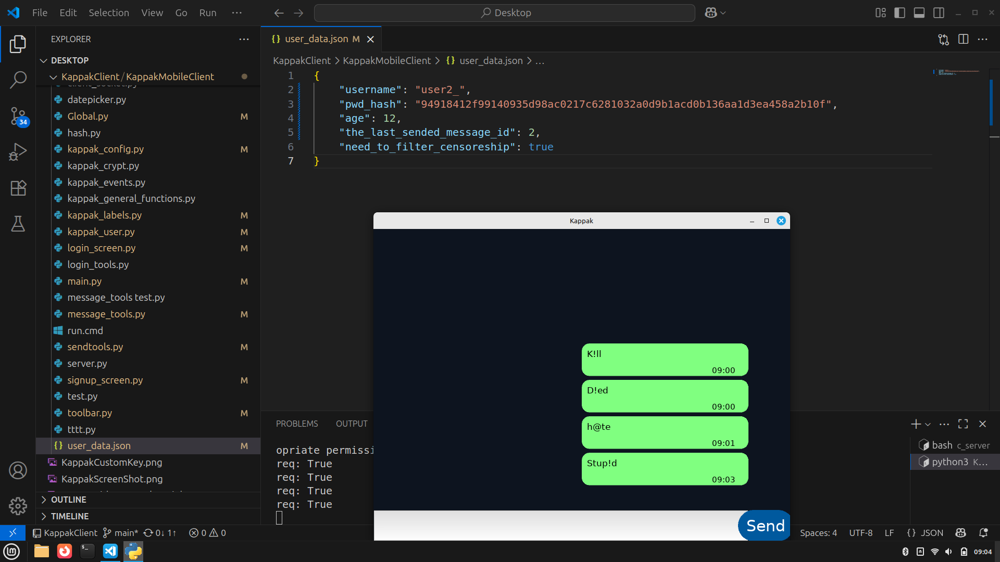

# Kivy Chat Client

A lightweight, mobile-friendly chat client built with **Kivy**.  
Designed for a C-based server backend (not included here), this educational project focuses on basic encryption, clean UI, and playful experimentation.

---

## 📸 Screenshots

### 💬 Chat View

Simple message bubbles with timestamps and color separation for sent/received messages.



---

### 🔐 Optional Custom Key

Want extra security? You can enter a **custom shared key** — a phrase agreed on with your chat partner — which adds a layer of encryption *on top of the default one*.

Even the server never sees this key — it's stored locally and never transmitted.

You can also leave the field empty — **encryption still works**, just without the custom key.



---

### 🔎 Encrypted Message Example

Here's how the word `"TUMO"` might look on the server when encrypted using a custom key.  
Without the correct key, other users won't be able to read it.



---

### 👤 User Info & Basic Filtering

Each user has basic profile data like:

- `username`
- hashed `password`
- `age`

To show how chat apps can adapt to users, there's a **very basic demo filter** that slightly alters some words for underage users (e.g. `"hate"` becomes `"h@te"`).

This isn't real censorship — just a fun example.



---

## 🚀 Features

- 🌓 Dark theme & modern layout
- 💬 Messaging with timestamp bubbles
- 🔐 Built-in encryption (customizable with shared key)
- 👤 User registration and login
- 🧒 Optional word filtering based on age
- 💻 Connects to C-based server (not included)

---

## 🛠️ Installation

```bash
pip install kivy==2.3.1 kivymd==1.0.2
python main.py
